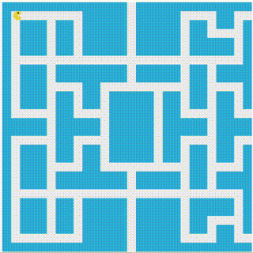

## Ruby Pacman Clone Running on WebAssembly

This is an unfinished version of the game.
Anyone is welcome to contribute.

## Running the app
Run a http server on this directory:

`ruby -run -e httpd . -p 8080`

## References
https://github.com/ruby/ruby.wasm
https://github.com/ruby/ruby.wasm/wiki/Showcase
https://www.youtube.com/watch?v=VawT9BQr3Wk&ab_channel=Confreaks
https://developer.mozilla.org/en-US/docs/Games/Tutorials/2D_Breakout_game_pure_JavaScript
https://github.com/microsoft/Web-Dev-For-Beginners/tree/main/6-space-game/4-collision-detection
https://samentries.com/index.php/2016/02/09/what-i-learned-from-building-a-pacman-clone/
https://www.piskelapp.com/p/create/sprite
